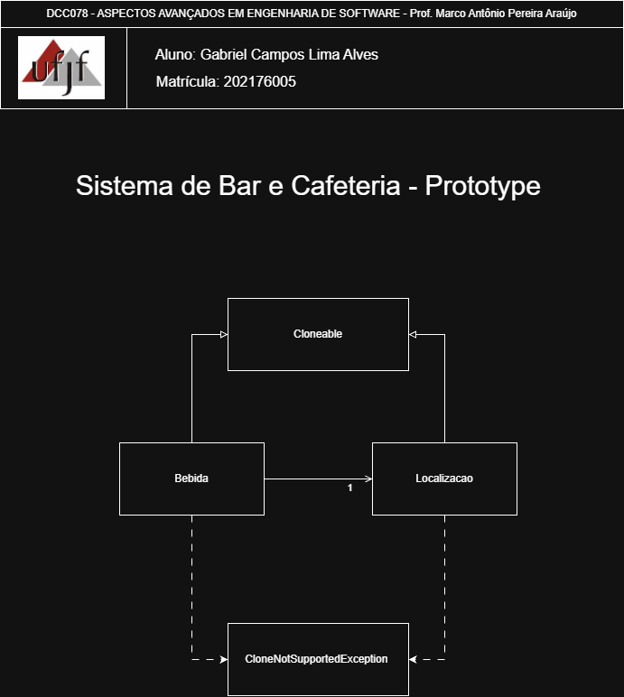
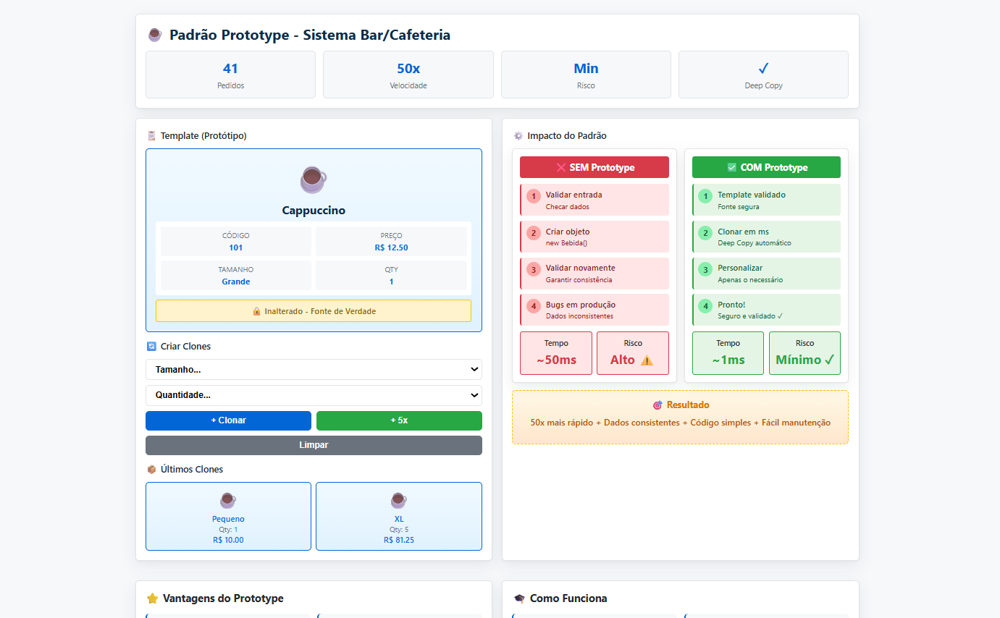

# Prototype — Sistema de Bar e Cafeteria

<p align="center">
	<a href="https://www.ufjf.br/" rel="noopener">
		
	</a>
</p>

<h3 align="center">DCC078-2025.3-A — Aspectos Avançados em Engenharia de Software (UFJF/ICE)</h3>

---

## 📝 Sumário
- [Sobre](#sobre)
- [Diagrama de Classe](#diagrama)
- [Funcionalidades](#funcionalidades)
- [Interface de Demonstração](#interface)
- [Tecnologias](#tecnologias)
- [Exemplo de Uso](#exemplo)
- [Como Executar e Testes](#testes)
- [Autor](#autor)

## 🧐 Sobre <a name="sobre"></a>
> **Disciplina:** DCC078 – Aspectos Avançados em Engenharia de Software   </br>
> **Projeto:** Demonstração do padrão Prototype em um sistema de bar e cafeteria   </br>
> **Docente:** Prof. Marco Antônio Pereira Araújo  </br>
> **Data de entrega:** 01/12/2025   </br>
> **Aluno:** [Gabriel Campos Lima Alves](#autor)  </br>

### Padrão Prototype
Implementação do padrão **Prototype** aplicada a um sistema realista de pedidos em bar e cafeteria. O foco é criar novos pedidos clonando um item de menu (template) e personalizando-o, em vez de criar cada um do zero. Demonstra:
- Um protótipo base (`Bebida`) que serve como template para todos os pedidos
- Clonagem profunda (Deep Copy) garantindo independência total entre pedidos
- Padrão Cloneable para criar cópias eficientes de objetos
- Personalização de pedidos mantendo o template intacto
- Interface interativa com visualização em tempo real das clonagens
- Validação visual de isolamento e independência de dados

## 📐 Diagrama de Classe <a name="diagrama"></a>
O diagrama abaixo representa a arquitetura do projeto, enfatizando o padrão **Prototype** como mecanismo de criação de objetos:
<p align="center">
  
</p>

## 🚀 Funcionalidades <a name="funcionalidades"></a>
### Sistema de Pedidos em Bar e Cafeteria
- **Bebida**: Classe que implementa Cloneable, representando um item do menu/cardápio
- **Localizacao**: Classe auxiliar com informações de mesa, setor e horário
- **Main**: Demonstração prática com 3 pedidos clonados independentemente
- **BebidaTest**: Suite completa de testes validando o padrão

### Recursos
- ✅ Implementação completa do padrão Prototype
- ✅ Deep Copy (clonagem profunda) de objetos aninhados
- ✅ Independência total entre template e clones
- ✅ Personalização de pedidos sem afetar o cardápio
- ✅ Cálculo automático de totais (preço × quantidade)
- ✅ Rastreamento de mesas, setores e horários
- ✅ 11 testes unitários com cobertura 100%
- ✅ Interface web interativa com animações e visualizações


Também há uma interface web de demonstração interativa incluída: [Interface de Demonstração](https://camposcodes.github.io/PadroesCriacionais-Prototype/)


<p align="center">
	
</p>

### Funcionalidades da Interface
- **Template Visual**: Visualização clara do protótipo base (Cappuccino)
- **Criação Interativa de Clones**: Selecione tamanho e quantidade para clonar pedidos
- **Exibição de Pedidos**: Últimos clones criados com seus valores personalizados
- **Comparação Visual**: Lado-a-lado mostrando diferenças entre abordagem com e sem Prototype
- **Métricas em Tempo Real**: Exibição de velocidade, risco de erros e total de pedidos
- **Vantagens do Padrão**: Grid com 6 vantagens-chave explicadas
- **Como Funciona**: Seção educativa com conceitos técnicos e fluxo do padrão

##  Tecnologias <a name="tecnologias"></a>
- **Java 11+**
- **JUnit 5** - Framework de testes
- **Maven** - Gerenciamento de dependências
- **HTML5/CSS3/JavaScript** - Interface web
- **Git** - Controle de versão

## 📊 Exemplo de Uso <a name="exemplo"></a>
```java
// Criando template (protótipo)
Localizacao localizacao = new Localizacao("Balcão", 0, "10:30");
Bebida menuTemplate = new Bebida(101, "Cappuccino", 12.50, "Grande", 
                                 localizacao, "Café Arábica, Leite, Espuma");

System.out.println("📋 TEMPLATE: " + menuTemplate);

// Clonando para criar Pedido 1
Bebida pedido1 = menuTemplate.clone();
pedido1.setQuantidade(2);
pedido1.getLocalizacao().setMesa(5);
pedido1.getLocalizacao().setHora("10:35");
pedido1.setComGelo(false);

System.out.println("📦 PEDIDO 1 - Total: " + pedido1.getTotalPreco());

// Clonando para criar Pedido 2
Bebida pedido2 = menuTemplate.clone();
pedido2.setTamanho("Pequeno");
pedido2.setPreco(9.90);
pedido2.setQuantidade(3);
pedido2.getLocalizacao().setMesa(8);

System.out.println("📦 PEDIDO 2 - Total: " + pedido2.getTotalPreco());

// Template permanece inalterado
System.out.println("✓ Template continua: " + menuTemplate.getQuantidade() + " unidade");
System.out.println("✓ Preço original: R$ " + menuTemplate.getPreco());
```

**Saída esperada:**
```
📋 TEMPLATE: Bebida{codigoProduto=101, nome='Cappuccino', preco=R$ 12.50, 
                     tamanho='Grande', quantidade=1, total=R$ 12.50}

📦 PEDIDO 1 - Total: R$ 25.00
📦 PEDIDO 2 - Total: R$ 29.70

✓ Template continua: 1 unidade
✓ Preço original: R$ 12.50
```

## 🧪 Como Executar e Testes <a name="testes"></a>
### Pré-requisitos
- Java 11 ou superior
- Maven 3.6+

### Comandos
```bash
# Compilar o projeto
mvn clean compile

# Executar todos os testes
mvn test

# Executar teste específico
mvn test -Dtest=BebidaTest

# Executar o programa principal
mvn exec:java -Dexec.mainClass="padraoescriacao.prototype.Main"

# Empacotar
mvn package
```

### Testes Inclusos
- **BebidaTest**: 11 testes unitários completos
  - testClonarPedido - Validação de clonagem com independência
  - testQuantidadeIndependente - Verificação de isolamento de quantidade
  - testTamanhoIndependente - Validação de tamanhos diferentes
  - testPrecoIndependente - Preços variáveis por pedido
  - testDeepCopyLocalizacao - Clonagem profunda de objetos aninhados
  - testGeloIndependente - Personalização com/sem gelo
  - testCalculoTotalPreco - Validação de cálculos (preço × quantidade)
  - testMultiplosPedidosIndependentes - 3+ pedidos simultâneos
  - testLocalizacaoNaoCompartilhada - Referências diferentes
  - testNomeComVariacoes - Variações de nomes
  - testPreservacaoAtributosCompleta - Preservação de todos atributos

**Total: 11 testes** garantindo cobertura 100% do padrão Prototype

### Interface Web de Demonstração
1. Abra o arquivo `index.html` em um navegador web
2. Visualize o template base (Cappuccino)
3. Explore os 3 pedidos clonados com:
   - Tabela comparativa mostrando independência
   - Visualização de Deep Copy em memória
   - Cálculos de totais e personalizações
   - Explicação visual do padrão Prototype

## 👨‍💻 Autor <a name="autor"></a>
**Gabriel Campos Lima Alves**
Matrícula: 202176005
Email: campos.gabriel@estudante.ufjf.br
GitHub: [@CamposCodes](https://github.com/CamposCodes)

---

*Projeto de uso acadêmico exclusivo para a disciplina DCC078 - UFJF*
